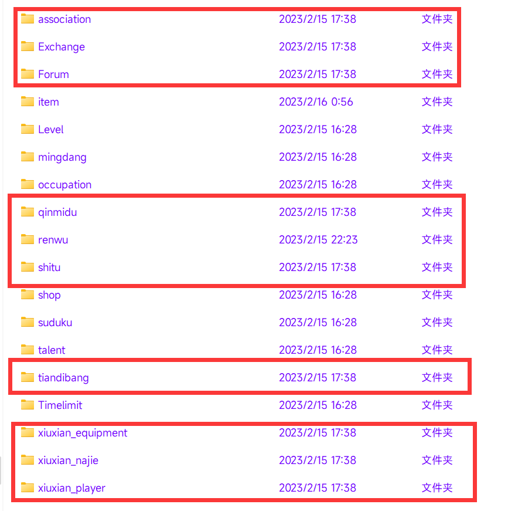

<div align="center">
<br>
<h1>绝云间修仙V1.3.0「龙腾虎跃庆周年」
</img>
</h1>
</br>
</div> 

## 此已停止更新，,欢迎提交request，正在制作V2.0版本(招人,美工,程序,测试都可以,是个人就行)，此版本详情见交流群
## 玩家攻略：
[修仙攻略](https://docs.qq.com/doc/DY25pbVlEakJaaW1u)  
## 访问量：        
<br> <br>       
## 安装      

> Miao-Yunzai/Yunzai-Bot/目录下执行  
### 使用Git安装

**Gitee**
```
git clone  https://gitee.com/hutao222/DDZS-XIUXIAN-V1.3.0/.git ./plugins/xiuxian@1.3.0/
```
**Github**
```
git clone  https://github.com/yll0614/DDZS-XIUXIAN-V1.3.0.git ./plugins/xiuxian@1.3.0/
```         
> [插件已适配频道和TRSS,推荐使用TRSS时雨崽搭配gocq插件以及频道插件使用](https://gitee.com/TimeRainStarSky/Yunzai)
## 转移存档            
     
存档位置  
```
\(Miao-Yunzai/Yunzai-Bot)\plugins\xiuxian@1.3.0\resources\data
```      
若要转移存档，将上面画框的文件保存，将修仙插件删除，执行上面安装命令，将上面画框的文件替换到对应文件,然后执行【#一键同步】 

## PS:该版本不稳定存在一定bug(绝对路径等)，如需更新请一定要备份好整个原版本
## 更新完后一定要发【#一键同步】，不要偷懒直接保存data文件夹
## 魔改内容  
> 1.新增职业系统:采药师,采矿师,炼器师,炼丹师,猎户     
> 2.新增宗门大战    
> 3.新增功法技能     
> 4.新增定制锻造武器     
> 5.新增世界副本(散兵,天理),划分分为人界和仙界（不可跨界）     
> 6.新增赠送物品和一键赠送物品     
> 7.实装小吉祥草等渡劫增益道具的增益效果     
> 8.新增突破概率提升道具:【破境丹】【幸运草】     
> 9.新增双塔(神魂,镇妖)     
> 10.宗门玩法大优化     
> 11.新增冒险家协会(挂需求物品)     
> 12.新增境界     
> 13.打劫回归     
> 14.新增仙界宗门     
> 15.世界财富无限     
> 16.新增拍卖行    
> 17.新增仙宠    
> 18.新增#一键同步，可以同步宗门、冒险家协会和存档    
> 19.修复一些bug以及显示  
> 20.师徒功能修复回归 2023-8-19     
> 21.每日任务开启 2023-8-18     
> 22.若陀龙王团本功能开启 2023-8-17     
> 23.官服一周年庆活动开启 2023-8-17     
> 24.适配TRSS时雨崽 2023-8-10     
> 25.适配QQ频道 2023-8-1     
> 26.炼器功能延续开发并优化 未知     
> 以下为闭源后零佬作出的贡献---特此感谢     
> 优化代码以及清除不平衡功能 未知     
> 新增锻造图纸造化·三千世界 2023-4-1     
> 优化装备代号逻辑 2023-4-1     
> 冲水堂+类型(筛选) 2023-4-2     
> 按时间排序(最新的在上面) 2023-4-2     
> 只有上架有手续费 2023-4-2     
> 上架超过3天的物品自动下架返还 2023-4-2     
> 同名物品只显示价格最低的 2023-4-2     
> 冲水堂优化 2023-4-2     
> 新增聚宝堂交易系统 2023-4-2     
> 冲水堂和聚宝堂费用为3% 2023-4-2      
> 修复渡劫问题 2023-4-5     
> 更新后在config/parameter/namelist.yaml配置群白名单 2023-4-9     
> 修复聚宝堂回收bug 2023-4-9     
> 修复渡劫失败bug 2023-4-9     
> 修复轮回去不了仙界的问题 2023-4-9     
## 常见问题
>如出现msgTask报错mark错误则是因为一些未知原因无法发送xiuxian@1.3.0\resources\data\temp\temp.json的消息卡死，将该文件清空打入一个[]即可
## 交流/直接游玩      
- 官群：372093406     
- 频道：https://pd.qq.com/s/38f5mycqd 
- 交流群、bug反馈群、攻略群：560090307 
## 鸣谢
> DD斩首(3196383818):仓库主人,合并,修复,优化和写新功能   
> 晓(765071948):来自云岚版本的佬,提供了部分功能代码支持   
> 再氪两单嘛(3479823546):数值策划      
> 墨羽(1095365435):提供了宗门     
> 啵唧(1702701528):提供许多武器，秘境，特殊道具     
> xh(917951214):职业功能   
> 零(3106256704):修复bug,维护功能  
> RetuEase(1099177812):开发，维护功能   
> 画手(1589978621):维护和处理bug  
> 晓飞(3365039038):提供了师徒系统和每日任务系统  
## 配置与存档   
> xiuxian@1.3.0/ config / xiuxian / xiuxian.yaml       
> xiuxian@1.3.0/ resources / data          
>可根据需求自行修改     
## 免责声明       
1. 功能仅限内部交流与小范围使用       
2. 请勿用于任何以盈利为目的的场景      
